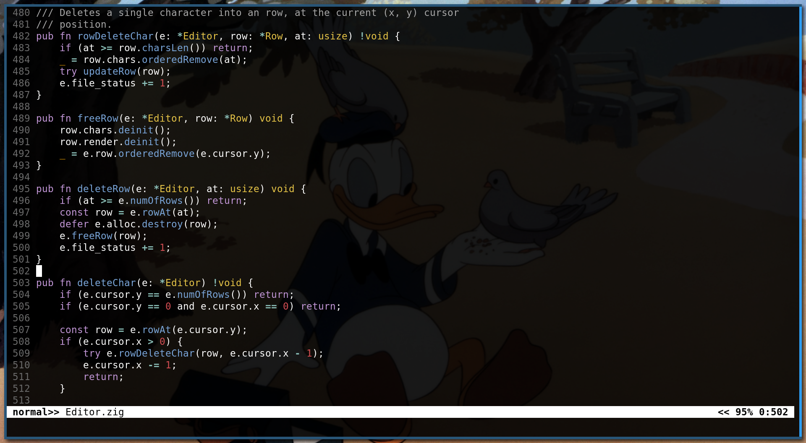

# nino

A terminal-based text editor similar to Vim, with multiple modes implemented. The editor currently supports:
1. Insert Mode: Users can type and insert text directly.
2. Normal Mode: Standard mode for navigating and issuing commands.
3. Visual Mode: Partially implemented, allowing users to select text.
4. Remap Functionality: A method for remapping keys or commands.

The project is still in progress, and further improvements to visual mode and other features may be necessary.

#### Build and run
Using zig master
> zig build run

#### Reference
thanks to kilo
> https://viewsourcecode.org/snaptoken/kilo/

#### Zig version 
> 0.14.0-dev.1632+d83a3f174